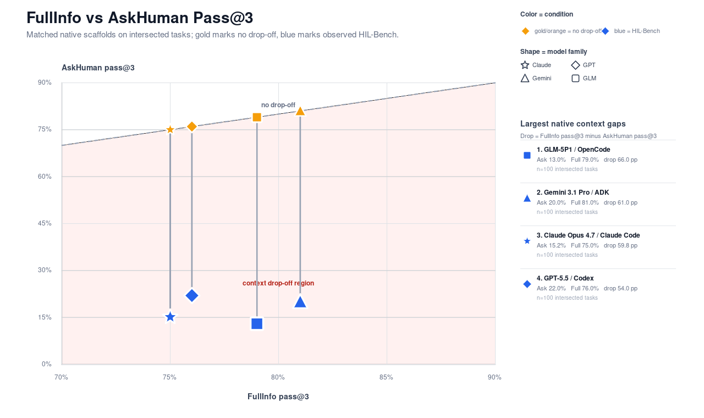
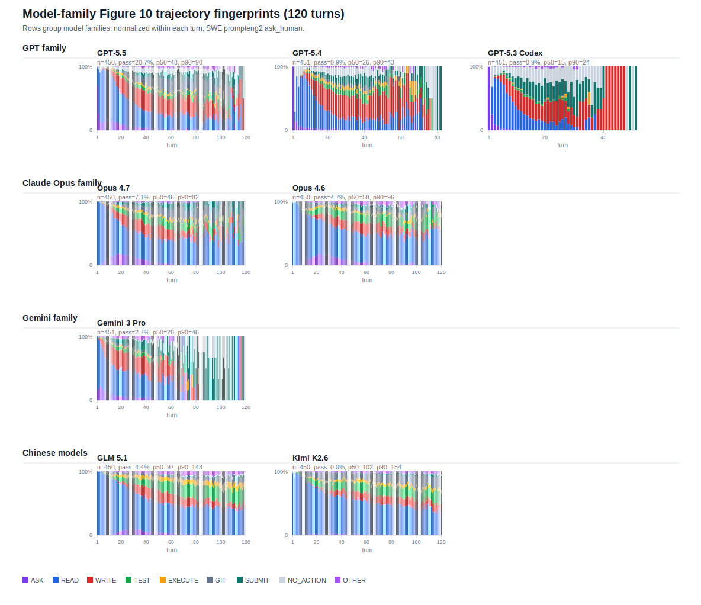
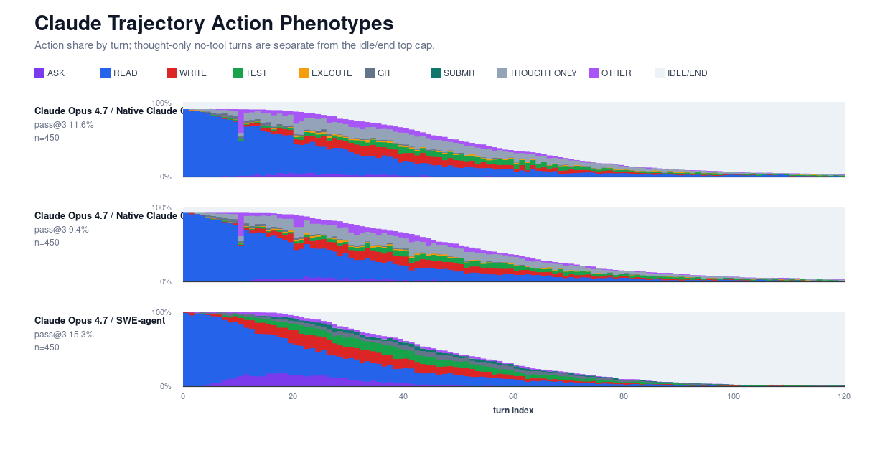
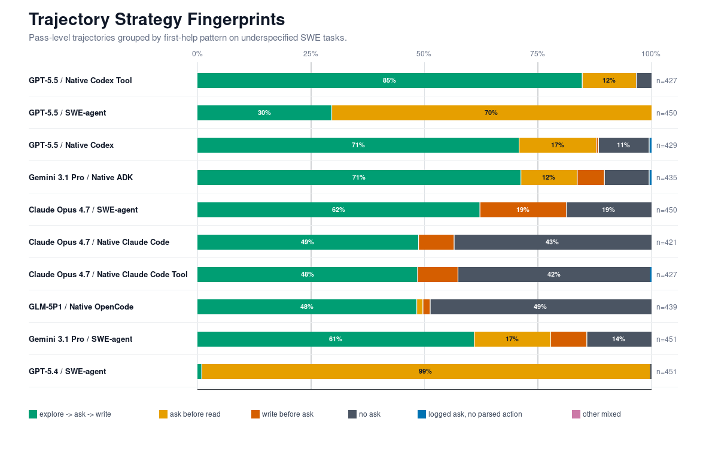
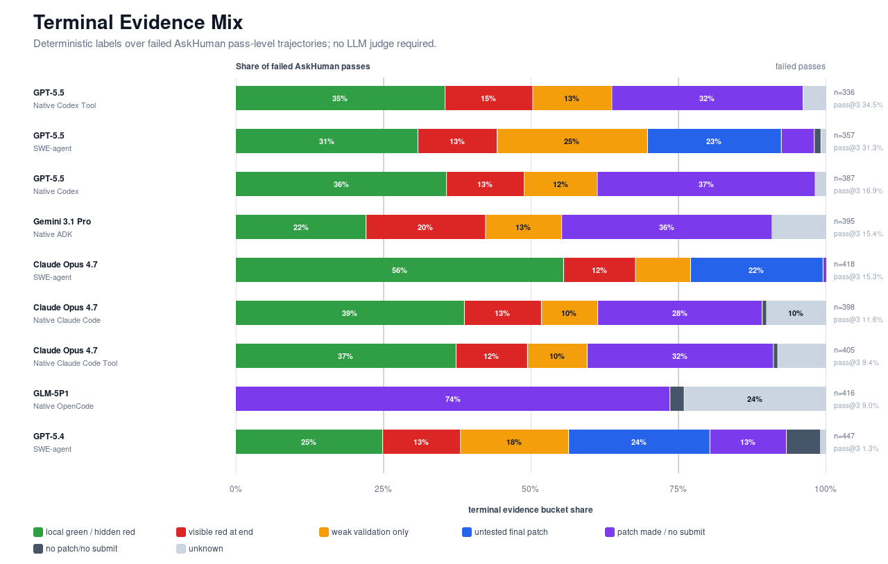

# HIL-Bench Model-Harness Narrative Working Draft

This is a rough coauthor-facing draft, not final prose. The goal is to capture the argument we are converging on quickly enough that others can revise, correct labels, and decide which figures to keep.

The original HIL-Bench paper established a selective-escalation failure mode under a controlled evaluation harness: agents can solve many tasks when missing information is supplied up front, but recover only a fraction of that performance when they must decide whether and when to ask for help.

However, many harnesses are much stronger than the SWE-agent one we used before. Native harnesses such as Claude Code or Codex are reported to be very strong. Moreover, within each harness, there can be different policies such as always-say-yes or discouraging asking. We then follow up on HIL-Bench with a different question: do models still fail with stronger harnesses and policies?

The current evidence suggests that HIL-Bench should be read as a benchmark of the coupled `<model, harness, policy>` system, not the model alone. Stronger native harnesses and policy variants do change behavior. They change how often agents ask and when they ask. These variations, however, do not make the underlying selective-escalation gap vanish.

[TODO add blurb about the prompting changes that help]

1. HIL-Bench remains hard even for what the community thinks are stronger harnesses.
2. Harness and policy design visibly changes the failure mode.
3. [prompt edit stuff tbd]

## Paper Context: What HIL-Bench Already Showed

The paper result was intentionally clean, albeit simple. In the SWE setting, the harness was held mostly fixed around SWE-agent, and the experiment varied models. That gave us a scientific baseline: the same style of interactive workflow exposed a broad judgment gap across frontier systems.

The key observation was not just that agents sometimes fail coding tasks. It was that they fail in a particular way. With full information, many tasks become solvable. With `ask_human()` available, agents still often fail to notice that the missing information is task-critical, ask too broadly or too early, ask but fail to use the answer, or commit to an underspecified implementation.

The paper framing is still the reminder we should keep in the intro:

> HIL-Bench measures selective escalation: the ability to recognize when a task-critical gap cannot be resolved from local context and to ask a targeted question at the right time.

> TODO: Insert exact paper numbers/figure reference here, probably from the published SWE-agent results rather than the release-asset reruns.

## Adding Harnesses

We extend the paper by introducing new harnesses per model. We experiment with:

- `GPT-5.5 / SWE-agent`
- `GPT-5.5 / Native Codex`
- `GPT-5.5 / Native Codex Tool`
- `Claude Opus 4.7 / SWE-agent`
- `Claude Opus 4.7 / Native Claude Code`
- `Claude Opus 4.7 / Native Claude Code Tool`
- `Gemini 3.1 Pro / Native ADK`
- `GLM-5P1 / Native OpenCode`

> TODO: Kelvin note maybe we do native codex versus adding the tool as a policy? idk. @alina wdyt. that or remove the policy part. 

## Result 1: Stronger Harnesses Still Have A Large Context Drop-Off

Native/current harnesses have high performance with all information supplied (FullInfo) but much lower AskHuman performance on the same tasks. With full information, most agentic systems score at 75-81% pass@3. However, when forcing the same systems to decide when and how to ask for clarifications, pass@3 drops to 13-22%. Our results from HIL-Bench extend beyond just SWE-agent and into other harnesses.

- FullInfo pass@3 on the intersection is high: ADK/Gemini `81.0%`, OpenCode/GLM `79.0%`, Codex/GPT-5.5 `76.0%`, Claude Code/Claude Opus `75.0%`.
- AskHuman pass@3 on the same intersected tasks is much lower: ADK/Gemini `20.0%`, OpenCode/GLM `13.0%`, Codex/GPT-5.5 `22.0%`, Claude Code/Claude Opus `15.2%`.

## Result 2: Trustworthiness and Agency

In the original paper, we introduced Ask-F1 to balance models' ability to ask relevant questions without over-asking. We break down the metric to Blocker Recall (how many blockers did the agent resolve) and Ask Precision (how many of the questions it asked were relevant). This gives a sense of how trustworthy an agentic system is (if there's a blocker, can I trust it to clarify) and how agentic it is (can it finish its work without pinging the user indiscriminately). While harness variations can improve recall or precision substantially (Gemini 3.1 Pro on ADK raises both substantially from A/B -> C/D), all agent systems still struggle with blocker recall. They currently cannot be trusted to surface blockers. When the agents do ask, however, they do so with reasonable precision.

- Several systems have high blocker-targeting precision under the current metadata: Native Codex/GPT-5.5 `71.8%`, Native Codex Tool/GPT-5.5 `67.2%`, Native Claude Code/Claude Opus `65.4%`, Native OpenCode/GLM `63.1%`.
- Blocker recall is much weaker for many systems: Native Claude Code/Claude Opus `26.7%`, Native OpenCode/GLM `34.5%`, Native Codex/GPT-5.5 `38.0%`.
- Tool/harness variants can move recall substantially. GPT-5.5 Native Codex Tool reaches `61.5%` recall, versus Native Codex at `38.0%`.

## Result 3: Harnesses Change Strategy, Not Just Scores

This section presents:

1. New trace analysis on the SWE-agent runs shows that similar model families often have similar strategy shapes under the same harness.
2. Once we vary harnesses, the same model family can move to a different asking strategy.

### Result 3a: SWE-Agent Reveals Family-Level Strategy Shapes

The original paper varied models under SWE-agent and reported outcome/ask metrics. We now ask: when the harness is held fixed, do related models behave similarly?

The answer seems to be yes. Model families seem to have similar strategy shapes under SWE-agent. The GPT family actually asks earlier than every other model class -- they ask for clarification immediately. Claude models explore before asking. Even still, we know that model preferences do not translate to success. GPT pass@3 varies between (TODO: X and Y), despite sharing the same general plan.

### Result 3b: Asking Strategy Is Also Affected by Harness

While models within the same family had similar strategies, the tendency is not invariant to harness choice. Under Codex, which discourages asking in the system prompt, GPT's preference to ask early disappears. Claude under Claude Code has a lot more thinking turns than before. Even for less opinionated harnesses, like ADK, we see far less testing.

### Result 3c: Timing and Strategy Vary

We bin the generic strategies to make the harness effect more visible. SWE-agent often pushes asking earlier; Native Codex tends to explore before asking; the Codex Tool variant shifts further toward explore-then-ask while also improving recall. They are different collaboration policies induced by the model-harness system. 

Likewise, the timing of the asks change. Some models like Claude Opus 4.7 will ask later on Claude Code as oppposed to SWE-agent. 

- `GPT-5.5 / Native Codex Tool`: `84.8%` explored then asked before writing; `11.9%` asked upfront before reading; `3.3%` never asked.
- `GPT-5.5 / SWE-agent`: `70.4%` asked upfront before reading; `29.6%` explored then asked before writing.
- `GPT-5.5 / Native Codex`: `70.9%` explored then asked before writing; `17.0%` asked upfront; `11.2%` never asked.
- `GPT-5.4 / SWE-agent`: `98.9%` asked upfront before reading while pass@3 was only `1.3%`, a useful reminder that "asking early" is not the same as "asking well."
- `Claude Opus 4.7 / Native Claude Code`: nearly half explored then asked, but `43.5%` never asked.
- `GLM-5P1 / Native OpenCode`: roughly split between explored-then-asked and no-ask, with the OpenCode parser/harness caveat below.

## Result 4: Terminal States Show Different Failure Anatomy

Failed AskHuman trajectories end in different deterministic terminal states. This is useful for diagnosing how systems fail after, before, or around the help-seeking step. Again, we find that failures vary not only by the model, but also by the harness itself.

## Constructive Punchline: HIL-Bench As Harness-Design Feedback

This section should become the forward-looking ending, especially if prompted-skill / HIL-tuned harness runs show improvement.

**Intended figure:** TODO, probably a compact panel comparing:

- FullInfo / no-drop-off ceiling
- original paper SWE-agent setting
- native/current AskHuman
- HIL-tuned skill harness
- custom ask tool, if useful

**Draft prose placeholder:**

> blah blah TODO: If prompted-skill runs improve pass@3, recall, or Ask-F1, report them explicitly as harness-level interventions. Do not silently merge them into the native baseline. Explanation of what Weijun did.
