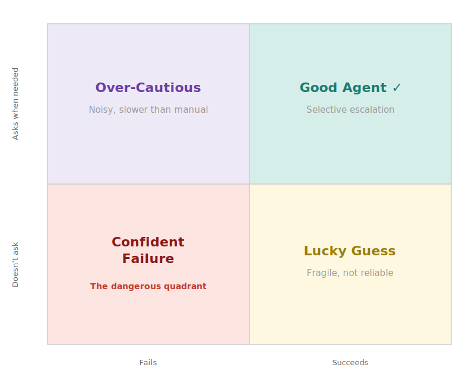

# HiL-Dynamics

**HiL-Dynamics measures how frontier agents behave when a task is underspecified.** When critical information is missing (a hidden constraint, a half-spec'd requirement, the one thing the PM never wrote down), does the agent stop and ask, or silently assume and ship the wrong answer?

HiL-Dynamics is the open-source companion to **[HiL-Bench](https://static.scale.com/uploads/67a153343e046988406ef320/HiL_Bench.pdf)**, our benchmark of underspecified tasks with human-validated blockers. It works across modern harnesses (Claude Code, Codex, Antigravity, ADK, OpenCode), captures full agent trajectories, and reports both *whether* agents finish and *how* they handled the missing information along the way. We call the underlying skill **selective escalation**: knowing what you don't know, and asking before charging ahead with an assumption.

**The headline result.** Frontier agents pass 75-80% of HiL-Bench tasks when given complete information. The same agents pass under 10% the moment 3-5 critical facts are withheld and they are forced to ask. Stronger harnesses don't close the gap, but skill engineering can move it, asymmetrically: Codex jumps from 7% to 53% pass@3 with a tuned skill, while Claude Code's best tuning only takes it from 3% to 15%.



*The four quadrants of agent behavior on underspecified tasks. Most modern agents sit in the confident-hallucination corner. See [analysis/Insights.md](analysis/Insights.md) for the full write-up.*

## Why use HiL-Dynamics

- **Quantify the judgment gap** between full-information and underspecified performance for any `{model, harness, skill}` setup.
- **Compare modern harnesses** on the same fixed set of underspecified tasks.
- **Inspect trajectories**, not just aggregate scores. See *when* the agent asked, *what* it asked, and how it recovered from a bad question.
- **Iterate on skill text** and escalation guidance, then re-measure to see what moved.

## Supported harnesses

| Harness | Default model | Default reasoning |
|---|---|---|
| `claude` | `claude-opus-4-7` | `xhigh` |
| `codex` | `gpt-5.5` | `xhigh` |
| `antigravity` | `gemini/gemini-3.1-pro-preview-customtools` | `high` |
| `adk` | `gemini/gemini-3.1-pro-preview-customtools` | `high` |
| `opencode` | `fireworks_ai/glm-5p1` | `high` |

## What HiL-Dynamics reports

Each run produces four metrics plus the full per-attempt trajectory:

- **pass@k.** Task resolution rate.
- **Ask Precision.** Share of asked questions that targeted a real blocker. Penalizes question spam.
- **Blocker Recall.** Share of registered blockers the agent surfaced through targeted questions.
- **Ask-F1.** Harmonic mean of Ask Precision and Blocker Recall. Structurally resistant to gaming.
- **Trajectories.** Complete `{thought, act, obs}` traces for manual inspection or LLM-as-a-judge analysis.

Each attempt saves a normalized bundle under `runs/<run-id>/<uid>/<mode>/pass_<n>/`:

```
attempt.json      task metadata
trajectory.json   [{thought, act, obs}, ...]
stats.json        num_steps, num_questions, num_blockers_resolved, ...
patch.diff        agent's git diff
result.json       solve outcome
eval_result.json  test pass/fail
```

## Key findings

See [analysis/Insights.md](analysis/Insights.md) for the full write-up. The three headline results:

1. **The judgment gap survives modern scaffolding.** Stronger harnesses haven't taught agents *when* to ask.
2. **Skill engineering is a real handle, but a harness-specific one.** Skill tuning that lifts Codex from 7% to 53% pass@3 only takes Claude Code from 3% to 15%.
3. **Every `{harness, model}` we tested has its own failure shape.** There is no universal recipe.

## Repository layout

```
bin/                  `hilbench` entry point (setup/run/analyze)
configs/              harness YAML configs
docker/               harness Dockerfiles
scripts/              ingest / build / run / eval / metrics orchestration
src/hil_swe/          SDK runners (claude / codex / adk / opencode / antigravity)
data/hil_bench_swe/   ingested task metadata + tasks_index
runs/                 run outputs (one folder per run-id, gitignored)
docs/                 schema + behavior reference
```

## Prerequisites

- Docker (running)
- Node.js 20+
- Python 3.10+

Install dependencies:

```bash
npm install
pip install litellm boto3 pandas pytest tqdm pyyaml
```

## First-time setup

**1. Configure credentials**

```bash
cp .env.example .env
```

Open `.env` and fill in the required fields:

```bash
# LiteLLM proxy. Recommended when running multiple harnesses.
LITELLM_BASE_URL="https://<your-litellm-endpoint>"
LITELLM_API_KEY="sk-..."

# HuggingFace token. Needed to pull task Docker base images.
HF_TOKEN="hf_..."

# Judge model. Required for ask_human-based arms (default and enhanced).
# Any instruction-tuned model your LiteLLM proxy serves works.
# Paper results used: "casperhansen/llama-3.3-70b-instruct-awq"
ASK_HUMAN_MODEL="<your-judge-model>"
```

If you have a direct API key rather than a LiteLLM proxy, you can omit `LITELLM_BASE_URL` and use provider-specific variables instead:

| Provider | Variables |
|---|---|
| Anthropic | `ANTHROPIC_AUTH_TOKEN=sk-ant-...` and `ANTHROPIC_BASE_URL=https://api.anthropic.com` |
| OpenAI | `OPENAI_API_KEY=sk-...` and `OPENAI_BASE_URL=https://api.openai.com/v1` |

The tool resolves credentials in this priority order: `LITELLM_API_KEY`, then `ANTHROPIC_AUTH_TOKEN`, then `OPENAI_API_KEY`. A LiteLLM proxy is recommended when running multiple harnesses (e.g. `claude`, `codex`, and `adk`) from a single endpoint.

**2. Ingest benchmark tasks**

```bash
# Example: ingest all 100 public set tasks at once
python3 scripts/ingest_hil_swe.py --all --p-set public

# Example: ingest a subset of the tasks by UID
python3 scripts/ingest_hil_swe.py --uids UID1 UID2 UID3
```

**3. Build Docker harness images**

```bash
# Example: build the claude-code harness for all 100 public set tasks with increased workers
python3 scripts/build_harness_images.py --sdk claude --p-set public --workers 8

# Example: build all harnesses for a subset of the tasks
python3 scripts/build_harness_images.py --sdk all --uids UID1 UID2 UID3
```

**4. Verify setup**

```bash
# Baseline check (deps, creds, tasks_index, runs/)
./bin/hilbench setup

# Optional: strict check adds a live ask_human judge probe
# (requires ASK_HUMAN_MODEL + working model credentials)
./bin/hilbench setup --strict
```

Example output when everything is ready:

```
  ✓ Python 3.11.4
  ✓ Node.js 20.17.0
  ✓ Docker running
  ✓ credential env found at .env
  ✓ LITELLM credentials present
  ✓ tasks_index.json found
  ✓ runs/ directory writable

All checks passed. Ready to run.
```

## Using HiL-Dynamics

### Running agents

```bash
# 1) default arm: ask_human mode only
./bin/hilbench run --harness claude --p-set public --arm default --passes 3

# 2) enhanced arm: ask_human + skill + guidance (+ custom tool where supported)
./bin/hilbench run --harness codex --p-set public --arm enhanced --passes 3

# 3) full_info arm
./bin/hilbench run --harness antigravity --uids UID1 UID2 UID3 --arm full_info --passes 3

# Optional: use a saved UID list file
./bin/hilbench run --harness claude --uid-file data/hil_swe_20_attempt_test_set_uids.txt --arm default
```

### Analyzing runs

```bash
# Build report + metadata for one run
./bin/hilbench analyze --run-id <run-id>

# Inspect run-level summary (machine-readable)
python3 -m json.tool runs/<run-id>/metadata.json

# View aggregate metrics used by the report
python3 -m json.tool runs/<run-id>/metrics/summary.json
```

## Configuration files

Harness configs live in `configs/harnesses/` and are the only configs required for normal usage:

```
configs/harnesses/
  claude.yaml
  codex.yaml
  adk.yaml
  opencode.yaml
  antigravity.yaml
```

**Harness config fields:**

| Field | Description |
|---|---|
| `sdk` | `claude`, `codex`, `adk`, `opencode`, or `antigravity` |
| `model` | Model slug as understood by your LiteLLM proxy |
| `reasoning_effort` | `low`, `medium`, `high`, `xhigh`, `max` |

## Clarification routing

All harnesses route through the same sidecar backend (`src/hil_swe/ask_human_sidecar.mjs`), but their question surfaces differ:

| Harness | Native question surface | Extra custom tool option |
|---|---|---|
| Claude Code | `AskUserQuestion` | yes (`ask_human` custom tool) |
| Codex | `requestUserInput` | yes (`ask_human` custom tool) |
| Antigravity | native ask + optional custom tool path | yes (`ask_human` custom tool) |
| ADK | native `ask_human` tool | no separate toggle |
| OpenCode | no native surface; uses `ask_human` tool path | no separate toggle |

> **Note.** The blocker registry is never copied into the agent workspace. It is only mounted for the sidecar, so the agent cannot read the registry to game the metric.

For full output schema and details, see [docs/run_output_schema.md](docs/run_output_schema.md).
For harness caveats and interpretation notes, see [docs/harness_asymmetries.md](docs/harness_asymmetries.md).
