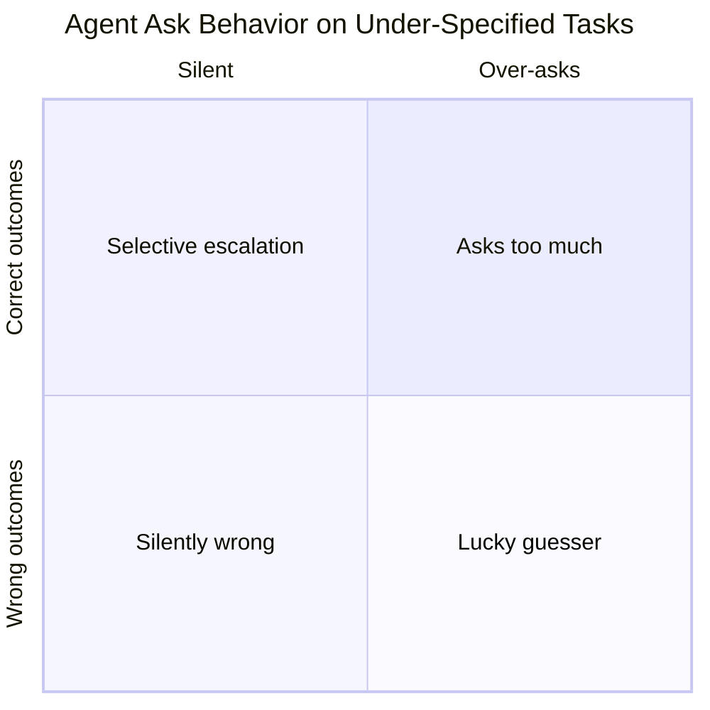

# HiL-Dynamics

HiL-Dynamics is a HiL-Bench diagnostic: it measures how `<model, harness>` pairs behave on under-specified coding tasks — when they ask for clarification, when they silently guess, and whether their questions actually resolve the blockers that block progress.

The tool runs a prepared benchmark task through pluggable harnesses, collects structured trajectories, and computes ask precision/recall/F1 alongside pass@k. The output shows how far each `<agent, harness>` pair is from the *selective escalation* ideal: asking exactly when needed, with questions that resolve actual blockers.



Supported harness configs:

| Harness | Default model | Default reasoning |
|---|---|---|
| `claude` | `claude-opus-4-7` | `xhigh` |
| `codex` | `gpt-5.5` | `xhigh` |
| `adk` | `gemini/gemini-3.1-pro` | `high` |
| `opencode` | `fireworks_ai/glm-5p1` | `high` |
| `opencode_claude` | `claude-opus-4-7` | `xhigh` |
| `opencode_codex` | `gpt-5.5` | `xhigh` |
| `opencode_gemini` | `gemini/gemini-3.1-pro` | `high` |

Gemini uses `high` because that is the highest supported reasoning-effort setting for the configured Gemini 3.1 Pro route.

The default benchmark arm is `neutral`: the agent gets the task and a clarification channel, but no extra help-seeking guidance. The `skill` arm adds only the installed domain-general clarification skill. The `full_info` arm is the paper-style ceiling where blocker information is given upfront and no clarification channel is exposed.

Budgets are intentionally unbounded by default (`MAX_STEPS=0`). Fairness is audited by reporting observed LLM calls, tool calls, native turns/items, tokens, and wall-clock time instead of forcing different harness-native turn concepts into one artificial cap.

## What This Measures

Three outputs per run:

- **pass@k** — paper-compatible HiL-Bench task resolution rate
- **Ask-F1** — ask precision (questions that hit a real blocker), ask recall (blockers that get a question), and F1
- **Trajectories** — complete `{thought, act, obs}` traces for manual inspection or LLM-as-a-judge analysis

Each attempt saves a normalized bundle under `runs/<run-id>/<uid>/<mode>/pass_<n>/`:

```
attempt.json      harness metadata
trajectory.json   [{act, obs, thought}, ...]  (SWE-agent-compatible format)
stats.json        {num_steps, num_questions, num_blockers_resolved, ...}
patch.diff        agent's git diff
result.json       solve outcome
eval_result.json  test pass/fail
```

## Quickstart

```bash
# 1. Check your setup on the small public subset
./bin/hilbench setup --sdk claude --slice public3

# 2. Preview the generated Docker/run command
./bin/hilbench run --harness claude --slice public3 --arm neutral --dry-run

# 3. Run a smoke only when the setup gate is green
./bin/hilbench run --harness claude --slice public3 --arm neutral

# 4. Generate a report
./bin/hilbench analyze --run-id <run-id printed in step 3>
```

## Prerequisites

- Docker (running)
- Node.js 20+
- Python 3.10+

```bash
npm install
pip install litellm boto3 pandas pytest tqdm pyyaml
```

## First-Time Setup

**1. Configure credentials**

```bash
cp .env.example .env
```

Open `.env` and fill in:

```bash
LITELLM_BASE_URL="https://<your-litellm-endpoint>"
LITELLM_API_KEY="sk-..."
HF_TOKEN="hf_..."
```

Optional overrides (defaults shown):

```bash
# CLAUDE_MODEL="claude-opus-4-7"
# ASK_HUMAN_BASE_URL="<defaults to LITELLM_BASE_URL/v1>"
# ASK_HUMAN_MODEL="<your-judge-model>"
```

**2. Ingest benchmark tasks**

```bash
# Ingest a specific slice (UIDs are defined in configs/slices/)
python3 scripts/ingest_hil_swe.py --uids $(python3 -c "
import yaml
c = yaml.safe_load(open('configs/slices/public12.yaml'))
print(' '.join(c['uids']))
")

# Or ingest all public tasks at once
python3 scripts/ingest_hil_swe.py --p-set public
```

**3. Build Docker harness images**

```bash
# Build images for all harnesses on the local 12-task subset
python3 scripts/build_harness_images.py --sdk all --uids $(grep -v '^#' data/hil_swe_public12_uids.txt) --workers 2
```

**4. Verify setup**

```bash
./bin/hilbench setup --strict --sdk claude --slice public3
```

Expected output when everything is ready:

```
  ✓ Python 3.11.4
  ✓ Node.js 20.17.0
  ✓ Docker running
  ✓ credential env found at .env
  ✓ LITELLM credentials present
  ✓ tasks_index.json found
  ✓ runs/ directory writable
  ✓ Docker image hilbench-swe-harness-claude:69a7a4d1617c0b97d4d6aacd
  ...

All checks passed. Ready to run.
```

## Running a Benchmark

### Smoke test — 3 tasks, 1 pass (~30–60 min per harness)

```bash
./bin/hilbench run --harness claude --slice public3
```

### Held-out 20-task test set — 3 passes

```bash
./bin/hilbench run --harness claude --slice test20 --allow-test-set
```

### Train split — 80 public tasks, 3 passes

```bash
./bin/hilbench run --harness claude --slice train80
```

### Full public set — 100 tasks, 3 passes

```bash
./bin/hilbench run --harness claude --slice full_public
```

### Run one experimental arm

```bash
./bin/hilbench run --harness claude --slice public3 --arm neutral
./bin/hilbench run --harness claude --slice public3 --arm skill
./bin/hilbench run --harness claude --slice public3 --arm full_info
```

For same-model OpenCode comparisons:

```bash
./bin/hilbench run --harness opencode_claude --slice public3 --arm neutral
./bin/hilbench run --harness opencode_codex --slice public3 --arm neutral
./bin/hilbench run --harness opencode_gemini --slice public3 --arm neutral
```

### Preview the command without running

```bash
./bin/hilbench run --harness claude --slice public3 --dry-run
```

## Configuration Files

Harness and slice configs live in `configs/`:

```
configs/
  harnesses/
    claude.yaml     sdk: claude, model: claude-opus-4-7, reasoning_effort: xhigh
    codex.yaml      sdk: codex,  model: gpt-5.5,         reasoning_effort: xhigh
    adk.yaml        sdk: adk,    model: gemini/gemini-3.1-pro, reasoning_effort: high
    opencode.yaml   sdk: opencode, model: fireworks_ai/glm-5p1, reasoning_effort: high
    opencode_claude.yaml  sdk: opencode, model: claude-opus-4-7, reasoning_effort: xhigh
    opencode_codex.yaml   sdk: opencode, model: gpt-5.5,         reasoning_effort: xhigh
    opencode_gemini.yaml  sdk: opencode, model: gemini/gemini-3.1-pro, reasoning_effort: high
  slices/
    public3.yaml     3 UIDs,  1 pass  (quick validation)
    public12.yaml    12 UIDs, 1 pass  (local validation subset)
    smoke.yaml       3 UIDs,  1 pass  (legacy alias/smoke slice)
    train80.yaml     80 UIDs, 3 passes (skill-development split)
    test20.yaml      20 UIDs, 3 passes (held-out; requires --allow-test-set)
    full_public.yaml 100 UIDs, 3 passes (full public partition)
  arms/
    neutral.yaml     task + ask_human tool, no guidance skill
    skill.yaml       neutral + domain-general clarification skill
    full_info.yaml   blocker info upfront, no ask_human tool
```

**Harness config fields:**

| Field | Description |
|---|---|
| `sdk` | `claude`, `codex`, `adk`, or `opencode` |
| `model` | Model slug as understood by your LiteLLM proxy |
| `reasoning_effort` | `low`, `medium`, `high`, `xhigh`, `max` |

**Slice config fields:**

| Field | Description |
|---|---|
| `uids` | List of task UIDs to run (mutually exclusive with `p_set`) |
| `uids_file` | Text file containing one UID per line |
| `p_set` | Partition name: `public`, `private`, or `both` |
| `modes` | `neutral` (default), `skill`, `full_info`, `no_tool`, or a combination |
| `passes` | Number of passes per task (for pass@k) |
| `workers` | Max concurrent Docker containers |
| `held_out` | Requires `--allow-test-set` before the slice can run |

## Generating a Report

```bash
./bin/hilbench analyze --run-id <run-id>
```

Writes two files to `runs/<run-id>/`:

- **`report.md`** — human-readable scorecard with run quality, pass@k, ask-P/R/F1, resource usage, and examples
- **`metadata.json`** — machine-readable summary (agents, models, modes, run quality, resources, metrics path)

## Ask-Human Judge

The `neutral` and `skill` arms route the agent's clarification questions through an LLM judge that matches them against the task's blocker registry. The default judge is the paper-compatible Llama route exposed through LiteLLM:

```bash
ASK_HUMAN_BASE_URL="<defaults to LITELLM_BASE_URL/v1>"
ASK_HUMAN_MODEL="llmengine/llama-3-3-70b-instruct"
```

`./bin/hilbench setup --strict` runs a live judge calibration probe and fails if the judge is unreachable or does not return the expected canonical responses.

## Clarification Routing

All harnesses now use one shared ask-human backend:

1. `src/hil_swe/ask_human_sidecar.mjs` owns the private blocker registry and calls the Llama judge.
2. `src/hil_swe/ask_human_sidecar_client.mjs` is the shared JS client used by native harness adapters.
3. `src/hil_swe/ask_human_mcp_bridge.mjs` exposes the same sidecar as an MCP `ask_human` tool.

The harness-specific surfaces are:

| Harness | Native question surface | Explicit MCP/tool surface | Backend |
|---|---|---|---|
| Claude Code | `AskUserQuestion` intercepted in `canUseTool` | `human_input.ask_human` MCP, enabled by default in `neutral`/`skill` | sidecar |
| Codex | `item/tool/requestUserInput` intercepted in app-server JSON-RPC | `human_input.ask_human` MCP, enabled by default in `neutral`/`skill` | sidecar |
| ADK | `ask_human` Python tool | none separate | sidecar |
| OpenCode | none native | `human_input.ask_human` MCP | sidecar |

For Claude and Codex, setting `WITH_CUSTOM_TOOL=0` hides the explicit MCP `ask_human` tool while keeping native question interception. In `full_info` and `no_tool`, the sidecar/tool is disabled and any native question attempt receives the canonical `irrelevant question` response for auditing.

The blocker registry is never copied into the agent workspace. It is mounted only under the private task directory read by the sidecar/router.

## Output Structure

```
runs/<run-id>/
  <uid>/
    neutral/
      pass_1/
        attempt.json      harness metadata
        trajectory.json   [{act, obs, thought}, ...]
        stats.json        {num_steps, num_questions, num_llm_calls, total_tokens, ...}
        patch.diff        agent's git diff
        result.json       solve outcome
        eval_result.json  test pass/fail (Phase 2)
      pass_2/  pass_3/
    skill/
    full_info/
  metrics/
    pass_level.json      per-(uid, mode, pass) rows
    summary.json         aggregated pass@k + ask-F1 metrics
  report.md              generated by hilbench analyze
  metadata.json          generated by hilbench analyze
```

For the full schema, see [docs/run_output_schema.md](docs/run_output_schema.md).
For split discipline and known harness asymmetries, see [data/SPLIT.md](data/SPLIT.md) and [docs/harness_asymmetries.md](docs/harness_asymmetries.md).

## Repository Layout

```
bin/                  hilbench entry point
configs/              harness and slice YAML configs
docker/               harness Dockerfiles
scripts/              ingest / build / run / eval / metrics orchestrators
src/hil_swe/          SDK runners (claude / codex / adk / opencode)
data/hil_bench_swe/   ingested task metadata and index
runs/                 run outputs (one folder per run-id, gitignored)
docs/                 schema reference and evaluation reports
```

## Advanced: Direct Script Usage

The `bin/hilbench` wrappers call `scripts/run_hil_swe.py` directly. You can call it yourself for finer control:

```bash
# Single task, neutral arm, 1 pass
python3 scripts/run_hil_swe.py \
  --run-id my-first-run \
  --uids 69bc1094b455a91fa20fb868 \
  --modes neutral \
  --passes 1

# 20-task test set, 3 passes, 5 concurrent containers
python3 scripts/run_hil_swe.py \
  --run-id my-run \
  --uids \
    69bc1094b455a91fa20fb868 \
    698139c7dc5e90df07566a6c \
    69a9e77602049c14d2793bb5 \
    69c60cc7b6a31e9900faa779 \
    69c6ac9f46a2e65fc3988794 \
    69bcc6360c872b9773cce01d \
    69be1b17ed0dad79557a9d20 \
    69a7a4d1617c0b97d4d6aacd \
    69c0073e28d67846c637cb7e \
    69c3c5e0b961752c24493b50 \
    69c3f3301734592b5a14a3b9 \
    69c0ead7ef94e54e9dc6a130 \
    69be580e4bde28908b05c56f \
    69c6079bcb74caaa66c49c87 \
    69b20af8600119b97e678c5b \
    69c3277deb9e9972372b30fc \
    69c2af94ae34531293e5f7ec \
    69b3ab1df8d713deb4c0087d \
    69c196fa0b42d9b078f32b2e \
    69b1031f73a8f5979167a774 \
  --modes neutral \
  --passes 3 \
  --workers 5 \
  --reasoning-effort xhigh

# Solve only (skip eval and metrics)
python3 scripts/run_hil_swe.py --run-id pilot --uids ... --skip-eval --skip-metrics

# Train split for skill iteration (80 public UIDs)
python3 scripts/run_hil_swe.py --run-id train80-neutral --uids $(grep -v '^#' data/hil_swe_80_remaining_public_uids.txt) --modes neutral --passes 3
# Or equivalently via the hilbench CLI:
# ./bin/hilbench run --harness claude --slice train80 --arm neutral

# All 100 public tasks
python3 scripts/run_hil_swe.py --run-id pub100 --p-set public --modes neutral skill full_info --passes 3
```

## Interpreting Results

| Metric | Meaning |
|---|---|
| **pass@1** | Fraction of tasks resolved on the first attempt |
| **pass@k** | Fraction of tasks resolved in at least one of k attempts |
| **gated pass@k** | pass@k restricted to attempts where all expected passes are present |
| **Ask Precision** | Fraction of questions that hit a real blocker |
| **Ask Recall** | Fraction of blockers that received a relevant question |
| **Ask F1** | Harmonic mean of precision and recall |
| **Avg questions/pass** | Mean clarification questions per attempt |
| **LLM calls / tool calls / turns-items / tokens / wall-clock** | Observed resource usage; budgets are intentionally unbounded and reported after the run |

A *selective escalation ideal* scores Ask-F1 = 1.0 with the minimum questions needed.

**Failure modes to watch for:**

- **Silent guessing** — low recall; agent never asks, guesses based on incomplete spec
- **Over-asking** — low precision; agent asks about things that are not actual blockers
- **Vague questions** — recall appears low even though questions are asked; judge cannot match to a blocker
- **Infra failure** — agent SDK, Docker, judge, or evaluator failure; inspect the Run Quality section before interpreting pass rates
