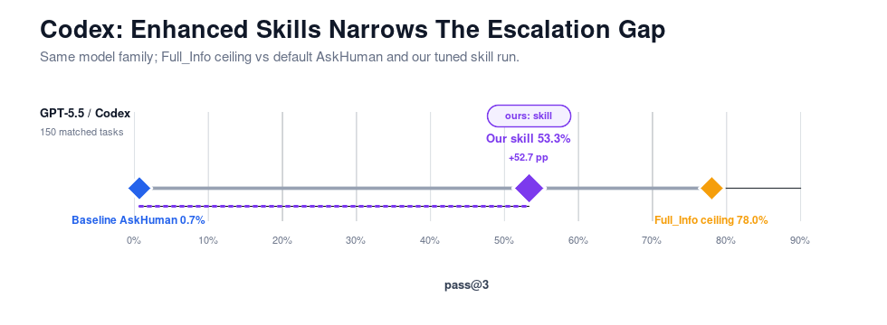
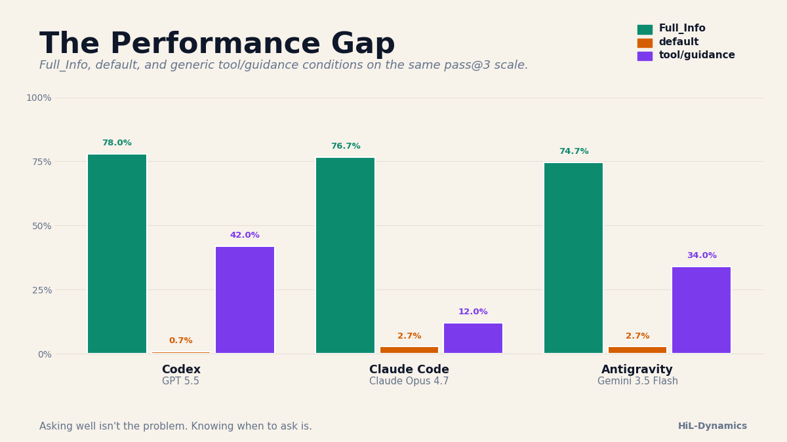
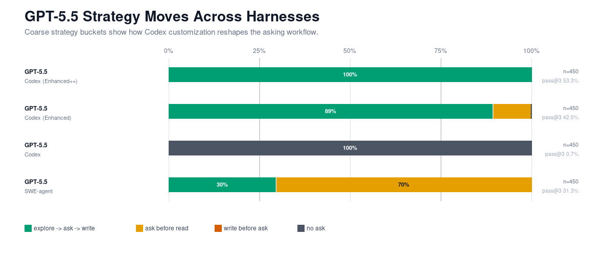
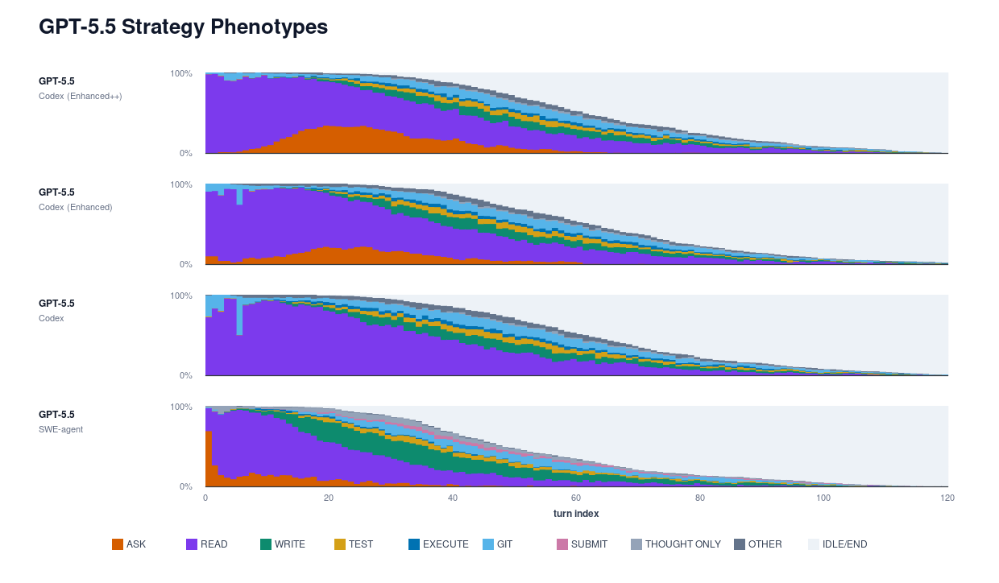

# HiL-Dynamics Narrative

## Introducing HiL-Dynamics

Earlier this year we released HiL-Bench, a benchmark to measure how well a coding agent can ask for help when faced with underspecified problems. The gap between a fully specified and underspecified prompt is large: agents with full information have an 80-90% pass@3, while agents with only partial information and an `ask_human()` tool top out at around 30%. The accompanying paper termed the common failure pattern **selective escalation**: the ability to identify when necessary information cannot be ascertained from the current context and ask for help from a human before continuing implementation.

We presented results using the SWE-agent harness. Since then, many harnesses and frameworks have been developed, including complete agentic ones such as Claude-Code and Codex. As a result, selective escalation is no longer a model-only property, but rather that of the entire agentic system. However, no matter how sophisticated agentic systems become, there will always be some context locked in someone's head: product intent, business norms, or the one thing the PM never wrote down.

Most people are working towards agentic autonomy. But facing underspecified problems with hidden context, it must be balanced with agentic trustworthiness. We introduce HiL-Dynamics, a diagnostic tool that unpacks how different agent configurations ask, explore, and fail with underspecified tasks. It runs HiL-Bench-style tasks across harnesses, then dissects the trajectories: when agents explore, when they ask, what they ask, whether they recover from bad questions, and how failed runs end.

We ran five native harness/model setups, including two Google-backed systems:

- Claude-Code SDK with Claude Opus 4.7
- Codex SDK with GPT 5.5
- Google-ADK with Gemini 3.1 Pro Preview
- OpenCode with GLM 5.1
- Google Antigravity with Gemini 3.5 Flash

We compare four conditions — see the Conditions table below. The headline figure in Finding 1 focuses on Full_Info vs native; tool/guidance and custom skill are reported later as scaffold-level interventions.

### Conditions

| Condition | What it provides | Used in |
|---|---|---|
| `Full_Info` | Missing context supplied up front; agents do not need to ask. | Finding 1 (upper-bound control) |
| `native` | Native ask affordance only — `AskUserQuestion` (Claude-Code), `requestUserInput` (Codex/Antigravity), or the custom `ask_human()` MCP for ADK/OpenCode. No skill or escalation guidance beyond harness defaults. | Findings 1, 2, 3 |
| `tool/guidance` | Native plus the shared escalation guidance package in the system prompt; Claude-Code and Codex additionally get a custom `ask_human()` MCP tool. | Findings 2, 3 |
| `custom skill` | Tuned `skill` template (Claude-Code and Codex only), layered on top of `tool/guidance`. | Findings 2, 3 |

TODO: confirm whether `baseline` is strictly the default system prompt or already includes minimal escalation framing — this determines whether Finding 1's gap is reported as native-harness behavior or a partially-instructed baseline.

### Two Distinct Contributions

This draft makes two contributions that should be kept separate when others read or revise it:

- **Evaluation claim:** modern agentic harnesses still leave large pass@3 on the table when faced with underspecification (Finding 1). This claim stands on existing data.
- **Design claim:** the diagnostic surfaces specific failure modes — blocker recall, escalation timing, recovery behavior, terminal-state mix — that motivate scaffold-level interventions, and we show one such intervention (skill-in-the-loop) recovers substantial performance (Findings 2 and 3). This claim depends on the skill-in-the-loop runs landing as currently reported.

Keeping these separate matters because the evaluation claim does not need the design claim to hold up. If the skill-in-the-loop intervention is later revised or weakened, the evaluation claim still stands.

**Key findings:**

1. **The performance gap survives scaffolding improvements.** Even with stronger harnesses, agents still struggle to decide *when* to ask for help.
2. **Skill engineering is a concrete handle.** Tuning the skill spec raises Codex pass@3 from 0.07 to 0.53 and ask-F1 from 0.20 to 0.62; gains for Claude-Code are more modest (pass@3 0.03 → 0.15), and no single template works universally across harnesses.
3. **Agents (harness + model) show very different strategies and failure patterns, and their optima diverge.**

## Finding 1: The Performance Gap Still Exists

We first gather agent performance directly out-of-the-box, with the harnesses' default system prompts. Claude-Code and Codex both have native question-asking capabilities (`AskUserQuestion` and `requestUserInput`, respectively), while ADK and OpenCode do not. For the latter we provided our own custom MCP tool that mirrors HiL-Bench's original `ask_human()` tool.

Selective escalation remained difficult, even when the harness provides the means to receive help. The two SDKs without native asking tools (ADK and OpenCode) produced different problem-solving approaches from their SWE-agent equivalents; model capability is not the only factor in performance here. On the other hand, the two agent SDKs that *do* have native asking tools (Codex and Claude-Code) didn't use them, largely due to the scaffold severely discouraging or preventing escalation during implementation. Based on our findings, we believe teaching agents to interweave exploration, planning, asking, and implementing in one go is an important area of future work.

### 1a: Native current-gen harnesses do well with full info, poorly without it

Full_Info pass@3 sits around 75–80% across systems — ADK/Gemini `80.0%`, OpenCode/GLM `79.3%`, Codex/GPT 5.5 `78.0%`, Claude-Code/Claude Opus `76.7%`, Antigravity/Gemini Flash `75.0%`. In the baseline condition (native ask tools only, or AskHuman-tool-only for SDKs without native escalation), pass@3 collapses: ADK/Gemini `8.0%`, Claude-Code/Claude Opus `2.7%`, Antigravity/Gemini Flash `2.7%`, Codex/GPT 5.5 `0.7%`, OpenCode/GLM `0.0%`.

The shared tool/guidance setup moves Codex, Antigravity, and ADK substantially: Codex reaches `42.0%` pass@3, Antigravity `34.0%`, and ADK `21.3%`. Claude-Code (`12.0%`) and OpenCode (`11.7%`) barely move (note: OpenCode's number has parser/submission caveats — see Finding 3d before drawing strong conclusions about OpenCode here). This is the broad setup comparison; we keep the tuned custom-skill rows out of this figure so the first finding does not mix generic harness augmentation with the later skill-specific intervention.

### 1b: Blocker Recall vs Ask Precision

To more directly assess how well these agentic systems selectively escalate, we use our original paper's ask-F1 metric, split into **Blocker Recall** (how many real blockers the agent surfaced) and **Ask Precision** (how many of its questions were relevant). Together they answer two practical questions: if there's a blocker, can I trust the system to clarify? And can it finish work without bothering the user indiscriminately?

Harness variations can move recall or precision substantially, but every system we tested still struggles with Blocker Recall. Several systems hit reasonable precision when they choose to ask — Native Codex/GPT 5.5 `71.8%`, Native Codex + tool/guidance `67.2%`, Claude-Code `65.4%`, OpenCode `63.1%` — but recall lags far behind: Claude-Code `26.7%`, OpenCode `34.5%`, Native Codex `38.0%`. Tool variants help: GPT 5.5 under Native Codex + tool/guidance reaches `61.5%` recall versus `38.0%` on Native Codex.

As above, this diagnostic plot keeps the tuned custom-skill rows out of the broad comparison. That keeps Detection vs Targeting aligned with the baseline and shared tool/guidance setup, while the custom-skill precision/recall tradeoff is handled in Finding 2.

These results reiterate HiL-Bench's original finding: agents still can't reliably decide when to ask for help. Even strong modern harnesses don't close the gap.

## Finding 2: Skill Engineering as a Concrete Handle

The constructive punchline: HiL-Bench is useful not only as a benchmark, but as feedback for building better coding agents. In real engineering workflows we never deploy a model alone — we wrap it in project-specific skills, tools, conventions, and escalation guidance. **Skill-in-the-loop** is the harness-design layer where we tune that wrapper.

We provided Claude-Code and Codex with thorough, well-written skill and escalation guidance in the system prompt, plus a custom `ask_human()` MCP tool — hypothesizing that the custom tool would be free from the bounds of their native training or prompting restrictions. The results are much better, with all SDKs showing significant improvement. All agents ask much more frequently, and Claude-Code and Codex utilize the custom tool more effectively than they do their native tool.

| system | clean tasks | pass@1 | pass@3 | Ask Precision | Blocker Recall | ask-F1 | avg questions |
|---|---:|---:|---:|---:|---:|---:|---:|
| `Claude Opus 4.7 / Native Claude-Code + custom skill` | `150` | `10.0%` | `14.0%` | `43.6%` | `31.3%` | `36.5%` | `2.55` |
| `GPT 5.5 / Native Codex + custom skill` | `150` | `36.7%` | `51.3%` | `48.9%` | `67.0%` | `56.5%` | `4.87` |

Skill text is not documentation. It is a behavioral prior — it shapes what the agent believes it is supposed to do before it reads a line of code.

### What kinds of skill techniques helped

Beyond just better performance, we uncovered interesting responses to different skill techniques:

- **When-to-ask guidance** intuitively bettered performance.
- **How-to-formulate guidance** also bettered performance — somewhat surprising, given the agents already know how to write questions in general.
- **Emotional language** — leveraging the agents' trained desire to fulfill requests with strong framing that they would fail if they don't ask — also yielded a performance boost.

### Six skill levers

The custom-skill sweep surfaced six non-leaking dimensions that independently steer behavior:

- **Gate** — eligibility condition for asking. Narrow gates restrict asking to rare cases ("cannot resolve from codebase"); wide gates make asking the default when implementation details remain uncertain.
- **Mandate** — force of the instruction to ask. Stronger mandates use language like "MUST ask" and explicit failure framing. The gate says *when*; the mandate says *with what conviction*.
- **Pre-Ask Sequence** — silent ordering step before asking. For example: enumerate blockers, pick the highest-impact unasked blocker, then ask. Controls cognitive ordering, not wording.
- **Question Quality Scaffolding** — definition of a good question, usually through bad/good examples or artifact anchors (file, function, schema field, test, observed behavior).
- **Anti-Fragmentation / COMBINE** — rule that related candidate questions about one artifact merge into a single question. Prevents burning asking opportunities on fragments of one decision.
- **Search Budget** — cap on local exploration before asking. Constrains indefinite search and acts as a tie-breaker when the gate is wide.

### Harnesses respond to skills differently

Beyond just better performance, we uncovered interesting responses to different skill techniques. Providing guidance about when to ask for help intuitively bettered performance, but surprisingly, not providing guidance about how to formulate a relevant question that would get answered. Emotionally leveraging the agents’ trained desire to fulfill requests with strong language that they would fail to do so if they don’t ask also yielded some performance boost.

However, as tunable as skills are, one important note is that no one skill yielded the maximal improvement from the default harness baseline for all agents. A skill that excels on one harness can even degrade performance on another. For example, Claude-Code and Codex have almost opposite asking priors, with the former being more open to asking questions. 

One skill variant we tried was removing the codebase escape hatch, — replacing the gate's permission to self-resolve ("cannot resolve it from the codebase") with a strict no-inference clause ("even implicit answers are not good enough"); this gave Claude-Code an +22% improvement in pass@3 due to it clarifying more blockers., However,but for Codex, it had zero effect since pass@3 held flat at 0.533, confirming the escape hatch never governed Codex's asking behavior. 

Another variant was strengthening the asking mandate and gate, which drastically improved Codex's pass@3 by +630% (0.073→0.533) with a near-10x increase in avg questions/pass (0.5→4.7), whilebut for Claude-Code produced a far more modest response; — avg questions/pass rose only +0.9 (vs Codex's +4.2), and pass@3 reached only 0.120, confirming that Claude modulates even strong mandate text against its inference priors. 

It would seem that Codex is much more responsive to mandate and gate volume settings, while Claude-Code relies a lot more on controlling its inference escape hatch. Our findings suggest that skill engineering should be calibrated per harness rather than applied uniformly. 

Overall, even with the best performance we could achieve with careful enhancements, all agents still showcase a great performance gap compared to when they are provided all information upfront.

## Finding 3: Agents Show Different Problem-Solving Patterns

HiL-Dynamics lets us look past aggregate pass rates and examine how an agent actually moved through an underspecified task. Two agents may fail for different reasons: one may write before resolving blockers; another may fail to validate its patches.

Examining trajectories surfaces what aggregate metrics miss. We highlight four aspects here.

### 3a: Model families have a characteristic strategy shape under a fixed harness

Under SWE-agent, related model families exhibit similar explore/ask/write shapes. GPT models ask early; Claude models do more early exploration before asking. Trajectory shape is a repeatable behavioral signature, not run-to-run noise.

### 3b: The same model bends to the harness

That family-level signature is not harness-invariant. GPT 5.5 asks early under SWE-agent, shifts toward early exploration under Native Codex, and — with the tuned custom skill — still explores first but asks more consistently before writing. Codex + custom skill is the extreme case: `99.8%` of pass rows ask before editing, median first ask at turn `18`, median first write at turn `36`.

To compare cleanly, we collapse each trajectory into a strategy bucket — asked upfront, explored then asked, wrote before asking, or never asked:

- `GPT 5.5 / Native Codex + tool/guidance`: `84.8%` explored then asked before writing; `11.9%` asked upfront; `3.3%` never asked.
- `GPT 5.5 / Native Codex + custom skill`: essentially all explore-then-ask-before-write (`100%` in the strategy CSV, `99.8%` in the timing CSV).
- `GPT 5.5 / SWE-agent`: `70.4%` asked upfront before reading; `29.6%` explored then asked.
- `GPT 5.5 / Native Codex`: `70.9%` explored then asked; `17.0%` upfront; `11.2%` never asked.
- `Claude Opus 4.7 / Native Claude-Code`: roughly half explored then asked, but `43.5%` never asked.
- `Claude Opus 4.7 / Native Claude-Code + custom skill`: `59.6%` explored then asked; `10.2%` wrote before asking; `29.8%` never asked.
- `GLM 5.1 / Native OpenCode`: roughly split between explored-then-asked and no-ask (parser/harness caveat below).

First-ask timing shifts the same way — Claude Opus 4.7 asks later under Claude-Code than under SWE-agent, for instance.

### 3c: Recovery after a bad first ask

Strong agents shouldn't only avoid bad questions — they should notice when a question missed the blocker, sharpen the next one, and still finish the task.

Using trace-level ask sequences, we deterministically mark the first irrelevant or incorrect `ask_human()` as `I` and a blocker resolution as `R`. For Codex we filter out MCP permission prompts, which are harness permission events rather than clarification questions.

Percentages below use first-failed-ask runs as the denominator. The table is regenerated from `data/bad_first_ask_recovery.csv`.

| system | first failed ask runs | solved after first failed ask | asked later relevant question | solved after later relevant question |
|---|---:|---:|---:|---:|
| `GPT 5.5 / SWE-agent` | 135 | 15.6% | 71.1% | 15.6% |
| `GPT 5.5 / Native Codex` | 67 | 6.0% | 16.4% | 1.5% |
| `GPT 5.5 / Native Codex + tool/guidance` | 107 | 19.6% | 57.0% | 17.8% |
| `GPT 5.5 / Native Codex + custom skill` | 118 | 30.5% | 72.9% | 28.8% |
| `Claude Opus 4.7 / SWE-agent` | 158 | 5.1% | 46.8% | 4.4% |
| `Claude Opus 4.7 / Native Claude-Code` | 63 | 6.3% | 20.6% | 0.0% |
| `Claude Opus 4.7 / Native Claude-Code + tool/guidance` | 59 | 0.0% | 18.6% | 0.0% |
| `Claude Opus 4.7 / Native Claude-Code + custom skill` | 86 | 1.2% | 37.2% | 1.2% |
| `Gemini 3.1 Pro / SWE-agent` | 112 | 0.9% | 83.0% | 0.9% |
| `Gemini 3.1 Pro / Native ADK` | 102 | 5.9% | 56.9% | 5.9% |

Codex + custom skill is the cleanest positive case: after a bad first ask, it more often asks a later relevant question and more often solves after doing so. Claude-Code + custom skill lifts the later-relevant-question rate but does not translate that into solves in this deterministic trace proxy.

### 3d: Failed runs end in different terminal states

Failed AskHuman trajectories terminate in deterministically distinguishable states, which lets us diagnose how systems fail before, around, or after the help-seeking step. Failures vary not only by model, but also by harness.

The custom-skill rows clarify what shifted under Codex. Among unresolved `GPT 5.5 / Native Codex + custom skill` passes, `35.5%` end as patch-made/no-submit, `32.4%` as local-green/hidden-red, `16.9%` as visible-red-at-end, and `15.2%` as weak-validation-only — substantive work failing to close the loop, not refusal to engage. Claude + custom skill looks similar (`37.9%` local-green/hidden-red, `35.7%` patch-made/no-submit).

## Takeaways

In real-world settings, human collaboration often means digging up information locked in people's heads and asking for clarification. Across our HiL-Dynamics experiments on different state-of-the-art agent harnesses, agents consistently struggle with this capability. No matter the harness or model, selective escalation on underspecified coding tasks remains an obstacle.

Each setup, however, balances exploration and escalation differently and fails in different shapes — suggesting targeted areas of improvement for future generations of models and harnesses, and enabling users to decide for themselves which setup best suits their needs. After all, almost all problems encountered in real-world engineering situations will be underspecified; users frequently write vague problems and hold hidden assumptions or tribal knowledge. We as a community need to push towards agents that aren't just capable of solving solo, but also of knowing when they need to ask for context hidden away in people's heads.

The unit of analysis is the whole `{model, harness, customization}` system — harnesses and skills change pass@3, ask-F1, question burden, strategy shape, and terminal failure anatomy. HiL-Dynamics is meant to make these differences visible: a way to evaluate whether a setup is **trustworthy** enough to surface blockers, **autonomous** enough not to ask indiscriminately, and **steerable** enough that targeted harness or skill changes improve behavior.

## Figure Inventory

| Figure | Used in | Role | Status |
|---|---|---|---|
| `01_same_model_different_scaffold` | Finding 1a | Primary: performance gap exists | 
| `15_codex_selective_escalation_gap` | Finding 1a | Codex deep-dive | 
| `02_detection_targeting` | Finding 1b | Primary: blocker recall vs ask precision | 
| `16_custom_skill_metric_lift` | Finding 2 | Primary: constructive result | 
| `13_swe_agent_model_family_strategy` | Finding 3a | Primary: model-family strategy fingerprint | 
| `14_codex_strategy_buckets` | Finding 3b | Codex strategy detail | 
| `17_gpt55_trajectory_strategy_fingerprints` | Finding 3b | GPT 5.5 trajectory fingerprint | 
| `05_strategy_buckets` | Finding 3b | Cross-system strategy summary | 
| `08_first_ask_timing` | Finding 3b | First-ask timing diagnostic | 
| `04_terminal_evidence_mix` | Finding 3d | Terminal-state decomposition | 
