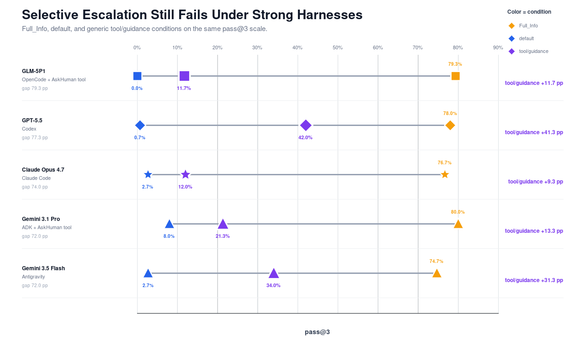
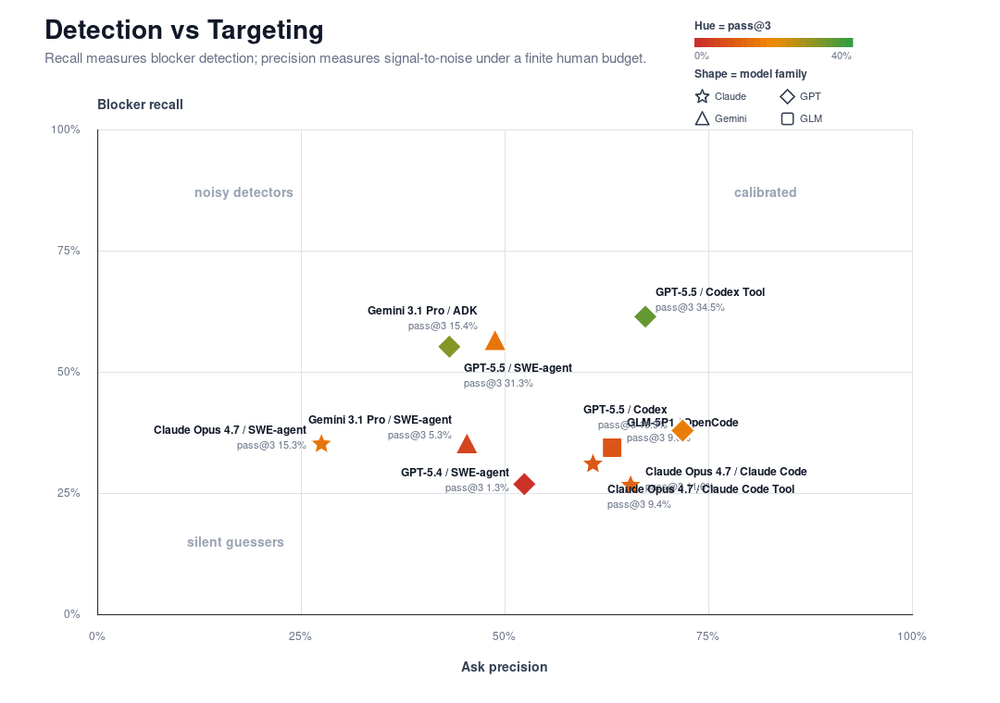
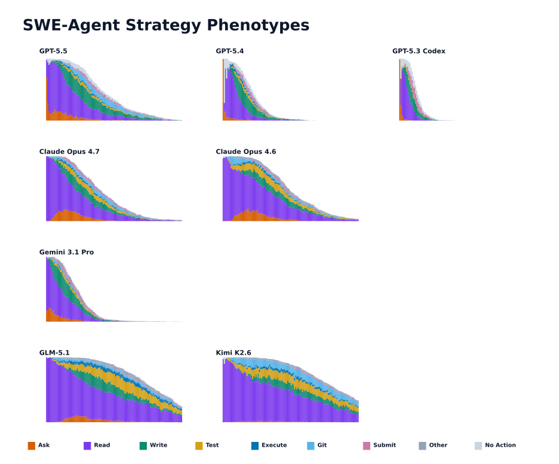
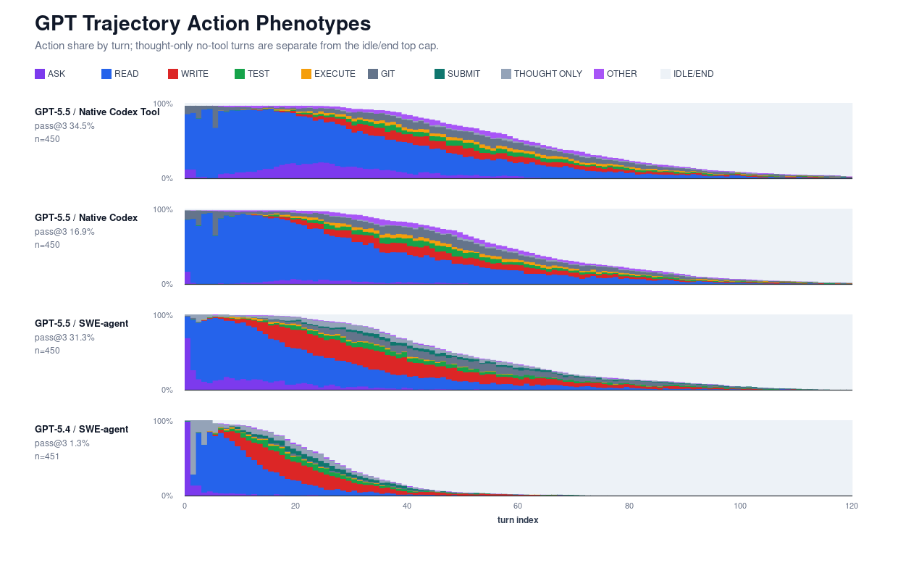
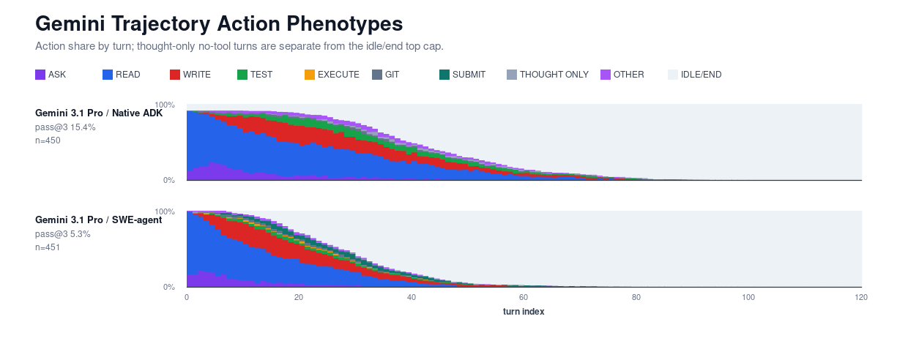
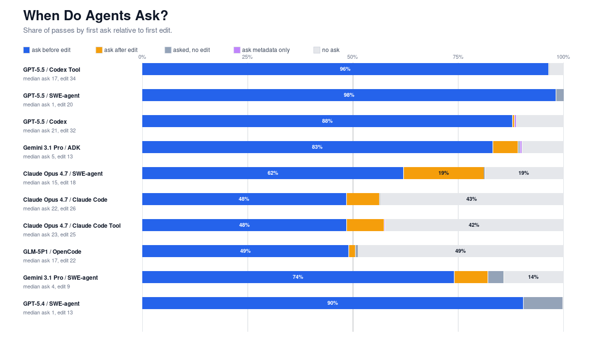
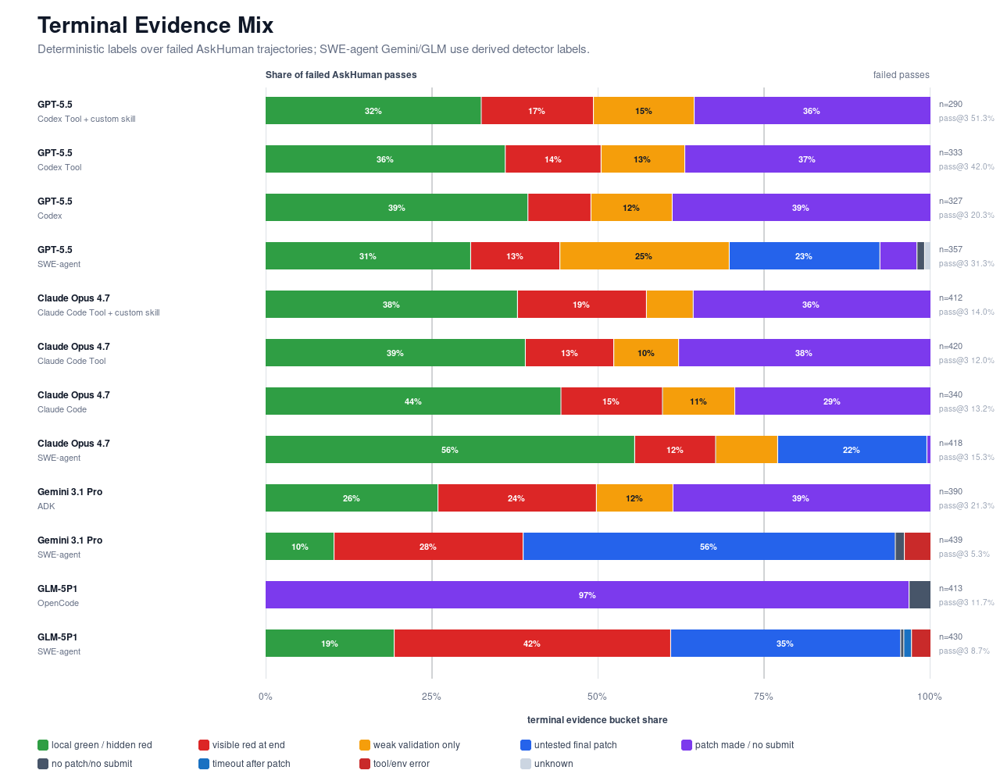

# HIL-Bench Model-Harness Narrative Working Draft

This is a rough coauthor-facing draft, not final prose. The goal is to capture the argument we are converging on quickly enough that others can revise, correct labels, and decide which figures to keep. Please remove this once all of us agree to this narrative.

The original HIL-Bench paper established a selective-escalation failure mode under a controlled evaluation harness: agents can solve many tasks when missing information is supplied up front, but recover only a fraction of that performance when they must decide whether and when to ask for help.

However, modern native harnesses such as Claude Code and Codex are much stronger than the SWE-agent setup we used before. Within each harness, policies can also vary: some encourage asking, some discourage it, and some add task-specific skills. We therefore follow up on HIL-Bench with a different question: do models still fail with stronger harnesses and policies?

We evaluate agents as a coupled `<model, harness, skills>` system, not the model alone. Stronger native harnesses and custom skills variants do change behavior. They change how often agents ask and when they ask. These variations, however, do not make the underlying selective-escalation gap completely vanish.

> kelvin: policy is probably a bit loaded. What we're doing is adjusting the skills.md instead of just policy?

1. HIL-Bench remains hard even for what the community thinks are stronger harnesses.
2. Harness and policy design visibly changes the failure mode.
3. Steering agent behavior with prompting skills, a common agent-engineering practice, helps agentic systems on HIL-Bench.

## Paper Context: What HIL-Bench Already Showed

The original paper used SWE-agent for clean experimentation. HIL-Bench showed that many SWE tasks are solvable when missing information is supplied up front, but are much harder when agents must decide whether to seek human help. The core failure is selective escalation: agents often miss task-critical blockers or ask vague, mistimed questions with an underspecified task.

> HIL-Bench measures selective escalation: the ability to recognize when a task-critical gap cannot be resolved from local context and to ask a targeted question at the right time.

> TODO: Insert exact paper numbers/figure reference here, probably from the published SWE-agent results rather than the release-asset reruns.

## Adding Harnesses

We extend the paper by introducing new harnesses per model. We include the following from our original benchmark:

- `GPT-5.5 / SWE-agent / ask_human() tool`
- `Claude Opus 4.7 / SWE-agent / ask_human() tool`
- `Gemini 3.1 Pro / SWE-agent / ask_human() tool`

In addition, we add native harnesses for these models. The following harnesses have built-in asking:

- `GPT-5.5 / Native Codex / default`
- `Claude Opus 4.7 / Native Claude Code / default`

The native harnesses for Claude and GPT, however, strongly bias against asking questions. To counter that, we also provide a policy that strongly suggests using a custom AskHuman tool. We include equivalent tools for OpenCode and ADK, which do not have built-in ask tools.

- `Gemini 3.1 Pro / Native ADK / custom ask_human() tool`
- `GLM-5P1 / Native OpenCode / custom ask_human() tool`
- `Claude Opus 4.7 / Native Claude Code / custom ask_human() tool`
- `GPT-5.5 / Native Codex / custom ask_human() tool`

Finally, we test whether custom skills, a common agent-engineering practice, can steer agents toward better collaboration. The skill in `skills.md` encourages agents to explore before editing and ask when local context cannot resolve a blocker.

- `Claude Opus 4.7 / Native Claude Code / with custom skills.md`
- `GPT-5.5 / Native Codex / with custom skills.md`

## Result 1: Stronger Harnesses Still Have A Large Context Drop-Off

Native/current harnesses have high performance with all information supplied (FullInfo) but much lower AskHuman performance on the same tasks. With full information, most agentic systems score at 75-81% pass@3. However, when forcing the same systems to decide when and how to ask for clarifications, pass@3 drops to 13-22%. Our results from HIL-Bench extend beyond just SWE-agent and into other harnesses. The closest are the two agent systems with custom skills.md. These [TODO]

- FullInfo pass@3 is high: ADK/Gemini `81.0%`, OpenCode/GLM `79.0%`, Codex/GPT-5.5 `76.0%`, Claude Code/Claude Opus `75.0%`.
- AskHuman pass@3 on the same intersected tasks is much lower: ADK/Gemini `20.0%`, OpenCode/GLM `13.0%`, Codex/GPT-5.5 `22.0%`, Claude Code/Claude Opus `15.2%`.

## Result 2: Trustworthiness and Agency

In the original paper, we introduced Ask-F1 to balance models' ability to ask relevant questions without over-asking. We break down the metric into Blocker Recall (how many blockers the agent resolved) and Ask Precision (how many of the questions it asked were relevant). This gives a sense of how trustworthy an agentic system is (if there is a blocker, can I trust it to clarify?) and how agentic it is (can it finish without pinging the user indiscriminately?). Harness variations can improve recall or precision substantially, but all agentic systems still struggle with Blocker Recall. Today's systems are not built to surface blockers. When the agents do ask, however, they do so with reasonable precision.

[TODO fix] The addition of custom skills.md to guide the models is the clear outlier. These agent systems act both reliably (0.7 and 0.85 blocker recall for Claude Code and Codex) while still being agentic (0.7 and 0.71 ask-precision respectively). These results quantitatively back the anecdotes of custom skills unlocking strong engineering performance in agentic engineering.

- Several systems have high blocker-targeting precision under the current metadata: Native Codex/GPT-5.5 `71.8%`, Native Codex Tool/GPT-5.5 `67.2%`, Native Claude Code/Claude Opus `65.4%`, Native OpenCode/GLM `63.1%`.
- Blocker recall is much weaker for many systems: Native Claude Code/Claude Opus `26.7%`, Native OpenCode/GLM `34.5%`, Native Codex/GPT-5.5 `38.0%`.
- Tool/harness variants can move recall substantially. GPT-5.5 Native Codex Tool reaches `61.5%` recall, versus Native Codex at `38.0%`.

## Result 3: Recovery After A Bad First Ask

We also ask whether an irrelevant first question is recoverable. In real scenarios, we hope that an agent would be able to re-align themselves after a poor question. We argue that a strong system would not simply never ask a bad question, but one that notices the miss and sharpens the question to complete the task.

Using the trace-level ask sequences, we deterministically mark the first irrelevant or incorrect `ask_human()` as `I` and a blocker resolution as `R`. For Codex, we filter out MCP permission prompts such as "Allow the human_input MCP server to run tool `ask_human`?" because those are harness permission events, not actual clarification questions.

Percentages below use first-failed-ask runs as the denominator. For Gemini 3.1 Pro / SWE-agent, raw trajectories were not available in this release bundle, so the recovery columns are inferred from the analysis CSV's first-ask-irrelevant flag and aggregate relevant-question count rather than an ordered ask sequence.

| system | first failed ask runs | solved after first failed ask | asked later relevant question | solved after later relevant question |
|---|---:|---:|---:|---:|
| `GPT-5.5 / SWE-agent` | 135 | 15.6% | 71.1% | 15.6% |
| `GPT-5.5 / Native Codex` | 88 | 4.5% | 17.0% | 1.1% |
| `GPT-5.5 / Native Codex Tool` | 97 | 12.4% | 52.6% | 10.3% |
| `Claude Opus 4.7 / SWE-agent` | 158 | 5.1% | 46.8% | 4.4% |
| `Claude Opus 4.7 / Native Claude Code` | 62 | 6.5% | 22.6% | 0.0% |
| `Claude Opus 4.7 / Native Claude Code Tool` | 51 | 0.0% | 19.6% | 0.0% |
| `Gemini 3.1 Pro / SWE-agent` | 112 | 0.9% | 83.0% | 0.9% |
| `Gemini 3.1 Pro / Native ADK` | 86 | 3.5% | 52.3% | 3.5% |

GPT-5.5 is still the strongest recovery case under SWE-agent, and the Codex Tool variant preserves part of that behavior. Surprisingly, Native Codex alone has high precision when it asks, but much weaker recovery after an initial miss. Claude Code has a few solves after a failed first ask, but none where the solve follows a later relevant clarification in this deterministic trace proxy.

[TODO] Add weijun exps

## Result 4: Harnesses Change Strategy, Not Just Scores

This section presents:

1. New trace analysis on the SWE-agent runs shows that similar model families often have similar strategy shapes under the same harness.
2. Once we vary harnesses, the same model family can move to a different asking strategy.

### Result 4a: SWE-Agent Reveals Family-Level Strategy Shapes

The original paper varied models under SWE-agent and reported outcome/ask metrics. We now ask: when the harness is held fixed, do related models behave similarly?

The answer seems to be yes. Model families seem to have similar strategy shapes under SWE-agent. The GPT family actually asks earlier than every other model class -- they ask for clarification immediately. Claude models explore before asking. Even still, we know that model preferences do not translate to success. GPT pass@3 varies between (TODO: X and Y), despite sharing the same general plan. [TODO add WJ]

### Result 4b: Asking Strategy Is Also Affected by Harness

While models within the same family had similar strategies, the tendency is not invariant to harness choice. Under Codex, which discourages asking in the system prompt, GPT's preference to ask early disappears. Claude under Claude Code has a lot more thinking turns than before. Even for less opinionated harnesses, like ADK, we see far less testing. [TODO add WJ]

### Result 4c: Timing and Strategy Vary

We bin the generic strategies to make the harness effect more visible. SWE-agent often pushes asking earlier; Native Codex tends to explore before asking; the Codex Tool variant shifts further toward explore-then-ask while also improving recall. They are different collaboration policies induced by the model-harness system. [TODO add WJ]

Likewise, the timing of the asks changes. Some models, such as Claude Opus 4.7, ask later on Claude Code than on SWE-agent.

- `GPT-5.5 / Native Codex Tool`: `84.8%` explored then asked before writing; `11.9%` asked upfront before reading; `3.3%` never asked.
- `GPT-5.5 / SWE-agent`: `70.4%` asked upfront before reading; `29.6%` explored then asked before writing.
- `GPT-5.5 / Native Codex`: `70.9%` explored then asked before writing; `17.0%` asked upfront; `11.2%` never asked.
- `GPT-5.4 / SWE-agent`: `98.9%` asked upfront before reading while pass@3 was only `1.3%`, a useful reminder that "asking early" is not the same as "asking well."
- `Claude Opus 4.7 / Native Claude Code`: nearly half explored then asked, but `43.5%` never asked.
- `GLM-5P1 / Native OpenCode`: roughly split between explored-then-asked and no-ask, with the OpenCode parser/harness caveat below.

## Result 5: Terminal States Show Different Failure Anatomy

Failed AskHuman trajectories end in different deterministic terminal states. This is useful for diagnosing how systems fail after, before, or around the help-seeking step. Again, we find that failures vary not only by the model, but also by the harness itself. [TODO add WJ]

## Result 6: HIL-Bench As Harness-Design Feedback

The constructive punchline is that HIL-Bench is useful not only as a model benchmark, but as feedback for how we build engineering agents. In real engineering workflows, we do not rely on the base model alone: we add project-specific skills, tools, conventions, and escalation policies. Given some of the errors above, the natural intervention is to teach agents to slow down, explore before editing, and use AskHuman when a blocker cannot be resolved from local context.

As a placeholder, Weijun's Skill9 aggregate results on the full 100 public-task set suggest that this kind of harness-level intervention can help. We do not yet have the trajectories for this run, so this table should be treated as aggregate evidence only; it cannot yet support the trace-level claims in Results 3-5.

| system | pass@1 | pass@3 | Ask Precision | Blocker Recall | Ask-F1 | avg questions |
|---|---:|---:|---:|---:|---:|---:|
| `Claude Opus 4.7 / Claude Code Skill9` | `21%` | `32%` | `71%` | `70%` | `69%` | `3.51` |
| `GPT-5.5 / Codex Skill9` | `53%` | `67%` | `75%` | `85%` | `77%` | `4.49` |

If these numbers survive validation on the same denominator as the native baselines, they would support the main interpretation: the selective-escalation gap is not just a model property. It is also shaped by the harness and policy layer, and targeted engineering guidance can move both task success and Blocker Recall.

**Waiting on:** Skill9 trajectories and confirmation that these aggregate metrics are computed on the same public-task denominator used in the comparison figures.

Placeholder -- [TODO] delete
